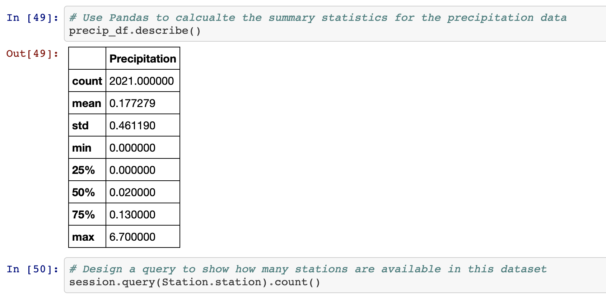
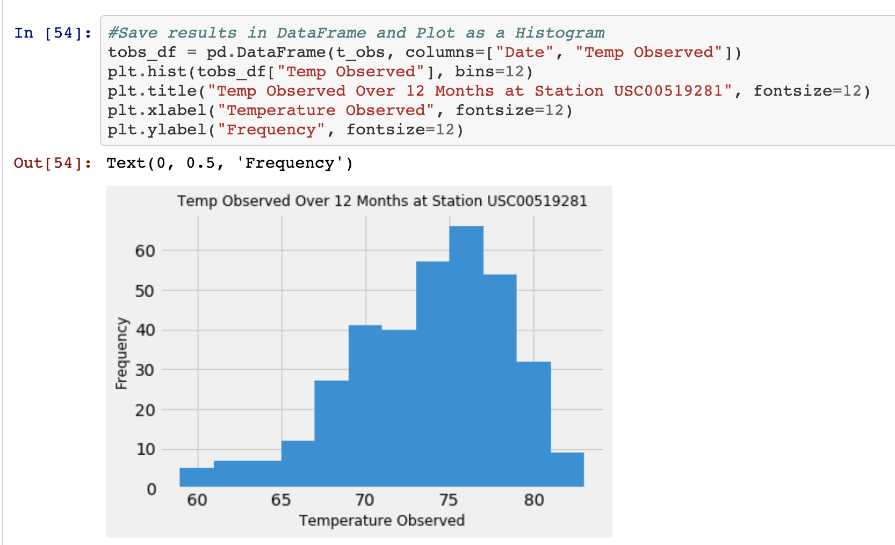
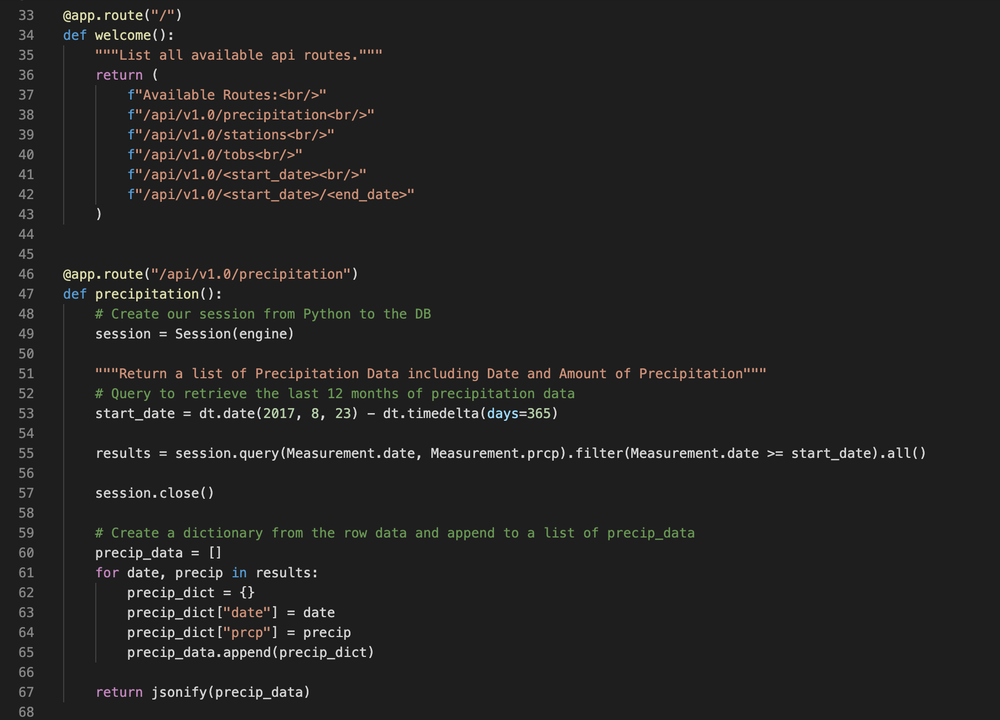

# Surf's Up! Hawaii Weather Analysis

## Project Overview

This project was mainly focused on the practice of data storage and retrieval. The goal was to utilize SQLAlchemy ORM (Object Relational Mapper) to connect the given [SQLite database](https://github.com/jobrien1726/sqlalchemy-challenge/blob/master/Resources/hawaii.sqlite) to Pandas, and to reflect the tables (Measurements and Stations) into classes in order to analyze temperature and precipitation data in Honolulu, Hawaii for a specified ten day vacation period. 

## Technologies Used

- SQLAlchemy
- Python
- Pandas
- Matplotlib
- DateTime
- NumPy
- Flask

## Data Exploration

### Precipitation Analysis

A SQLAlchemy ORM query was designed to retrieve the last 12 months of precipitation data. The results were then put into a Pandas DataFrame and susequently put into a plot using the DataFrame plot method.  

Pandas was used to find the summary statistics.

### Station Analysis

A SQLAlchemy ORM query was designed to analyze the following:

1. Calculate the total number of stations.
2. Find the most active stations.
3. Retrieve the last 12 months of temperature observation data (tobs).

The results of the final query were then plotted as a histogram with 12 bins using a combination of the DataFrame plot function and Matplotlib. 

## Climate App 

Once the initial analysis was complete, a Flask application was developed, including various different routes that convey the results learned through the previous queries.

The code for the Flask App can be viewed in its entirety [here](https://github.com/jobrien1726/sqlalchemy-challenge/blob/master/app.py).
