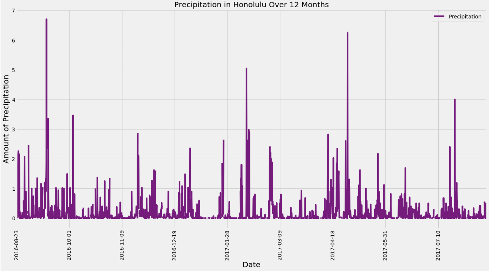

# Surf's Up! Hawaii Weather Analysis

## Project Overview

This project was mainly focused on the practice of data storage and retrieval. The goal of was to utilize SQLAlchemy ORM (Object Relational Mapper) to connect the given [SQLite database](https://github.com/jobrien1726/sqlalchemy-challenge/blob/master/Resources/hawaii.sqlite) to Pandas, and to reflect the tables (Measurements and Stations) into classes in order to analyze temperature and precipitation data in Honolulu, Hawaii for a specified ten day vacation period. 

## Technologies Used

- SQLAlchemy
- Python
- Pandas
- Matplotlib

## Data Exploration

SQLAlchemy ORM queries were used to analyze the following:

### Precipitation Analysis

A query was designed to retrieve the last 12 months of precipitation data. The results were then put into a Pandas DataFrame and susequently put into a plot using the DataFrame plot method.  

Pandas was used to find the summary statistics.

![] (Images/precip_stats.png)

